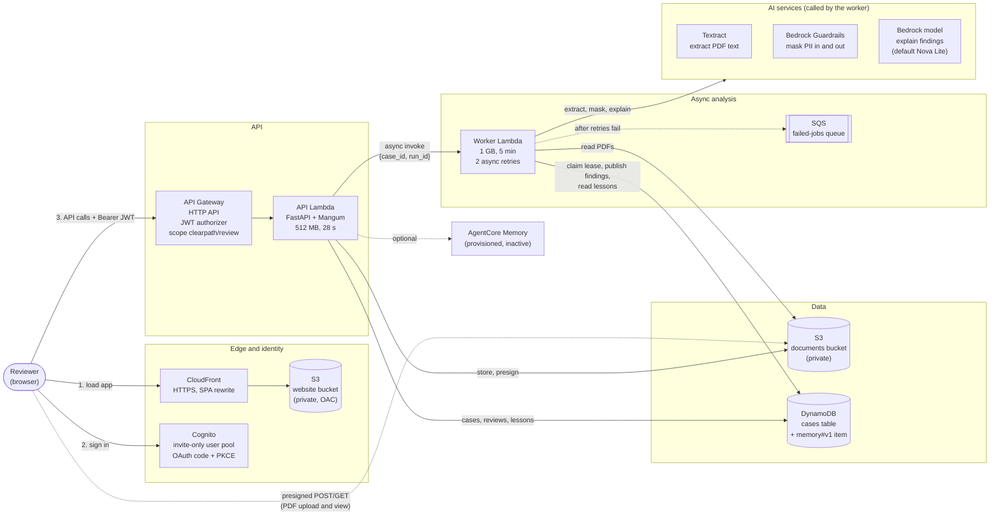
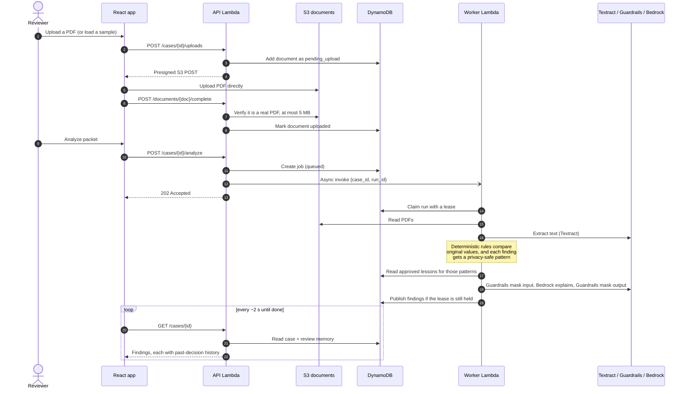
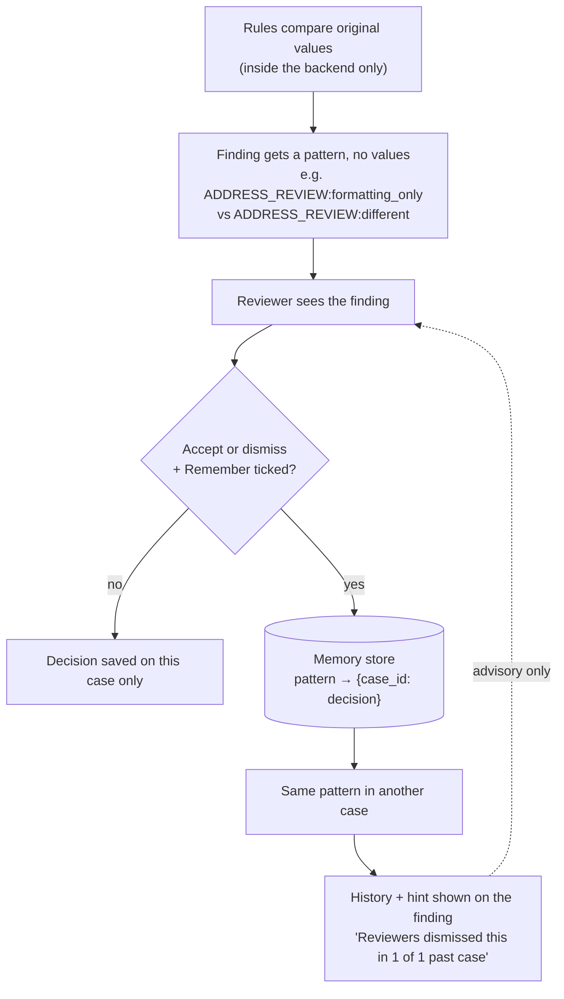
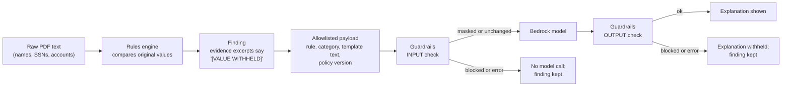
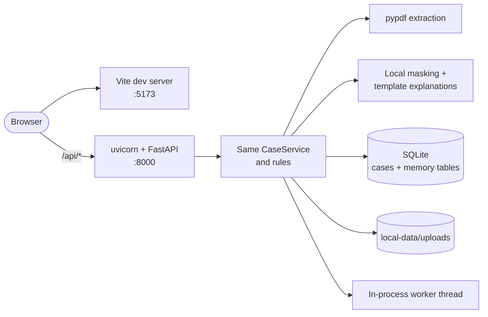

# ClearPath architecture

ClearPath checks synthetic account-transfer packets (client profile, transfer application, account statement) for missing fields and mismatches, lets a human reviewer accept or dismiss each finding, and remembers reviewer-approved decisions so similar findings in later cases come with context.

It runs in two modes from the same code:

- **AWS mode:** deployed serverless stack (Cognito, API Gateway, Lambda, S3, DynamoDB, Textract, Bedrock).
- **Local demo mode:** one process on a laptop with SQLite and local files; no credentials and no network calls.

The business logic (`backend/app/services/`) is shared by both. Only the **providers**, the adapters for storage, extraction, privacy and AI, change between modes.

> Hackathon prototype using synthetic data only. Not LPL policy, not production-ready, and not a compliance guarantee.


## 1. AWS deployment



| Component                     | Code                                                   | Role                                                                                                                                                 |
| ----------------------------- | ------------------------------------------------------ | ---------------------------------------------------------------------------------------------------------------------------------------------------- |
| CloudFront + website bucket   | `infra/lib/website.ts`                                 | Serves the built React app over HTTPS. The bucket is private; CloudFront reads it through Origin Access Control.                                     |
| Cognito                       | `infra/lib/clearpath-stack.ts`, `frontend/src/auth.ts` | Invite-only sign-in. The browser gets an access token with the `clearpath/review` scope.                                                             |
| API Gateway (HTTP API)        | `infra/lib/clearpath-stack.ts`                         | Rejects requests without a valid JWT (`401`) before they reach Lambda. Only CORS `OPTIONS` is unauthenticated.                                       |
| API Lambda                    | `backend/app/handlers/api.py`                          | The FastAPI app. Creates cases, signs S3 uploads, records reviews and lessons, dispatches analysis. Enforces case ownership per user.                |
| Worker Lambda                 | `backend/app/handlers/worker.py`                       | Runs one analysis: extraction, rules, privacy filtering, explanations.                                                                               |
| Documents bucket              | `S3DocumentStorage`                                    | Private PDF storage. The browser uploads and views through short-lived presigned URLs, so large PDFs never pass through Lambda.                      |
| DynamoDB                      | `DynamoCaseStorage`, `DynamoMemoryStore`               | One item per case (documents, job, findings, reviews), with optimistic-locking writes. Review memory is a single `memory#v1` item in the same table. |
| Failed-jobs queue             | SQS                                                    | Receives analysis events that still fail after Lambda's two automatic retries.                                                                       |
| Textract, Guardrails, Bedrock | `providers/aws/adapters.py`                            | Read PDF text; mask PII; write a short plain-language explanation of each finding.                                                                   |
| AgentCore Memory              | `providers/aws/agentcore.py`, `infra/lib/memory.ts`    | Provisioned for semantic lesson retrieval, but inactive until a strategy ID is configured. DynamoDB stays the source of truth.                       |

## 2. Analysis flow



Reliability details:

- **Leases:** the worker only processes a run it has claimed, so duplicate or retried deliveries never run the same analysis twice at once. An expired lease (timeout or crash) lets Lambda's retry take over.
- **Ownership checks on publish:** a worker that lost its lease, or a superseded run, cannot overwrite newer results.
- **Fail closed:** if extraction, masking or the model fails, the deterministic finding is kept and the job is marked `partial` or `failed`, never an all-clear. AWS failures never fall back to demo output.

## 3. Review memory

Reviewers decide each finding. When they also tick **Remember this decision for similar findings**, ClearPath records a lesson: the _kind_ of finding plus the decision, never the values.



Design rules:

- **Patterns, not data.** A pattern names the kind of finding (`SSN_MATCH:transposed_digits`, `ACCOUNT_MATCH:formatting_only`, `REQUIRED:transfer_application:Address`). Rules classify on original values inside the backend; only the label is stored. Names, SSNs, account numbers, addresses and reviewer notes never enter memory.
- **Explicit approval.** Only decisions with **Remember** ticked become lessons. Saving the same finding again without it withdraws that case's lesson.
- **Advisory.** History never changes, hides or dismisses a finding, its severity or the checklist. A hint appears only when past decisions lean at least 75% one way; otherwise it reports a split.
- **Other cases only.** A case's own decision never counts toward its own history, and one case counts once per pattern, however often it's re-decided.
- **No new infrastructure.** Memory is one versioned DynamoDB item (`memory#v1`) in AWS, or a `memory` table in the local SQLite file. Its key isn't a UUID, so the case API can't read it.

Code: `backend/app/services/rules.py` (patterns), `backend/app/services/memory.py` (record, withdraw, history), `CaseService.review` and `CaseService.get` in `backend/app/services/cases.py`.

## 4. Privacy boundaries



- The model never receives document text or identifiers, only an allowlisted summary of each deterministic finding. The UI shows exactly what it sees under **What the explanation provider sees**.
- Storage keys and user filenames are never returned by the API; keys are generated server-side.
- Logs record categories only (`case=… category=analysis_failed`), never document content or provider payloads.

## 5. Local demo mode



| Concern          | AWS mode                     | Local demo mode                      |
| ---------------- | ---------------------------- | ------------------------------------ |
| Composition      | `backend/app/aws_runtime.py` | `backend/app/main.py`                |
| Sign-in          | Cognito + JWT                | Demo sign-in (`VITE_AUTH_MODE=demo`) |
| Extraction       | Textract                     | `pypdf`                              |
| Privacy filter   | Bedrock Guardrails           | Local regex masking                  |
| Explanations     | Bedrock model                | Fixed templates                      |
| Cases and memory | DynamoDB                     | SQLite                               |
| Documents        | S3 with presigned URLs       | `local-data/uploads/`                |
| Analysis         | Async worker Lambda          | Thread in the API process            |

Sample packets (`complete`, `missing`, `conflicting`, `formatting`) live in `backend/app/samples/`, so both the laptop and the Lambda bundle can load them. Regenerate them with `demo/generate.py`.

## 6. Repository map

```
backend/app/
  handlers/        api.py (API Lambda), worker.py (worker Lambda)
  routes/api.py    HTTP routes, ownership checks
  services/        cases.py (workflow), rules.py (checks + patterns), memory.py (lessons)
  providers/       interfaces.py (ports), local/ (demo), aws/ (adapters, agentcore)
  schemas/         Pydantic API contract
  samples/         synthetic PDF packets
frontend/src/      React app: App, MemoryPanel, PdfViewer, LoginScreen, auth, api
infra/lib/         CDK: clearpath-stack.ts, website.ts, memory.ts
demo/              generate.py (sample PDFs)
docs/              API contract, handoff, runbooks
```

## 7. Status and known limits

- Deployed: CloudFront hosting, Cognito sign-in, JWT-protected API and `401` on unauthenticated calls are live-verified.
- Not yet validated end to end on AWS: the full upload → analyze → review flow, provider failure behavior, and two-user isolation.
- AgentCore Memory is provisioned but inactive; DynamoDB holds all review memory.
- Extraction supports small, single-page, text-based synthetic PDFs with known field labels. Scanned or multi-page documents are flagged for manual review.
- Synthetic data only. See `docs/handoff.md` and `docs/product-direction.md` for the full list.